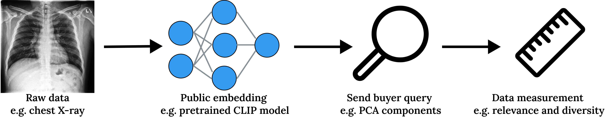

# Measuring data value with diversity and relevance

## Install python dependencies:
Run in terminal `python -m pip install -r requirements.txt`

### Google Colab:
Follow the instructions in `0-Colab-Setup.ipynb`

### Quick start demo:
Run the notebook `1-MNIST-compare.ipynb`

### Download precomputed CLIP embeddings
- [link to data](https://figshare.com/s/06bdbbe7c6133d2b2bb7)

### Anonymized repo
- [link to code](https://anonymous.4open.science/r/data-valuation-302F)
